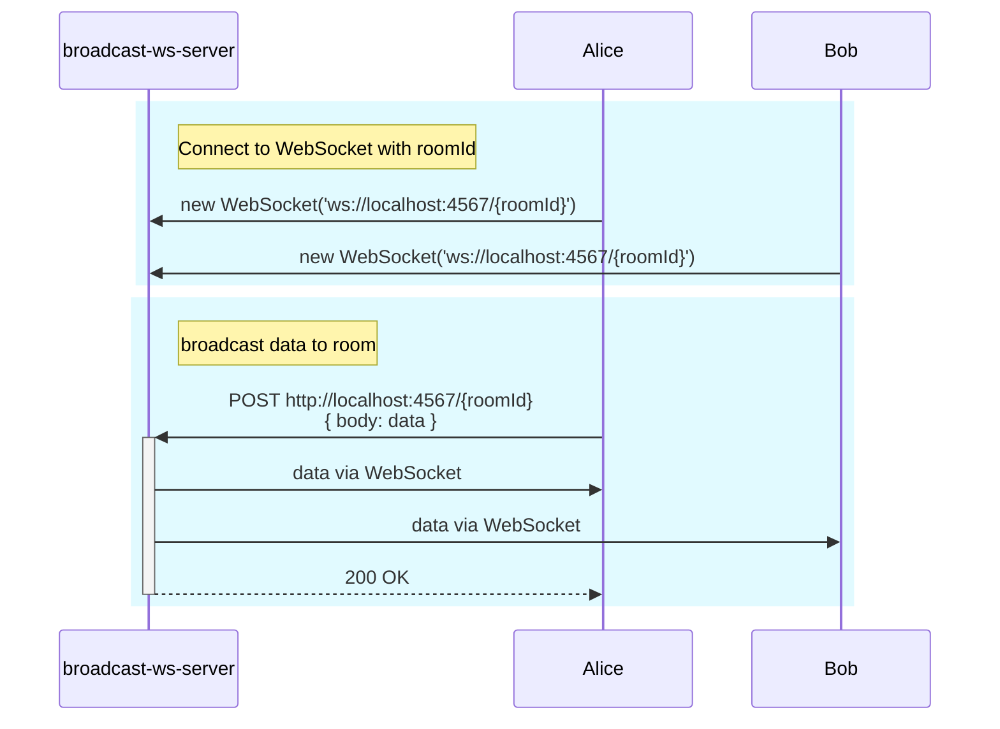

```mermaid
sequenceDiagram
    participant server as broadcast-ws-server
    participant a as Alice
    participant b as Bob

    rect rgb(225, 250, 255)
    note right of server: Connect to WebSocket with roomId
    a->>server: new WebSocket('ws://localhost:4567/{roomId}')
    b->>server: new WebSocket('ws://localhost:4567/{roomId}')
    end

    rect rgb(225, 250, 255)
    note right of server: broadcast data to room
    a->>+server: POST http://localhost:4567/{roomId}<br/>{ body: data }
    server->>a: data via WebSocket
    server->>b: data via WebSocket
    server-->>-a : 200 OK
    end
```

## Usage

```bash
npm i
npm run start
```

set `PORT` environment variable to change port number (default is 4567).
